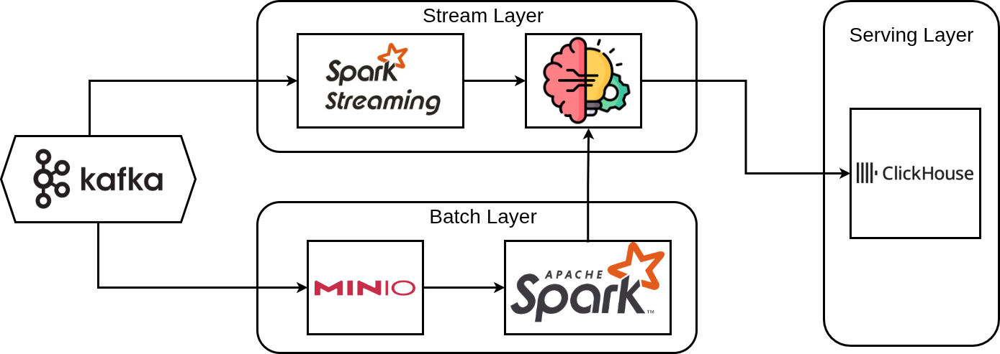

# Fraud Prediction Platform

---

<div align="center">

**Nền tảng phát hiện gian lận tài chính theo thời gian thực, kết hợp Stream Processing, Machine Learning và Web Dashboard.**

---

[](https://www.python.org/)
[](https://spark.apache.org/)
[](https://kafka.apache.org/)
[](https://clickhouse.com/)
[](https://min.io/)
[](https://fastapi.tiangolo.com/)
[](https://react.dev/)
[](https://www.docker.com/)
[](https://kubernetes.io/)

[Project Overview](#-project-overview) •
[Platform Features](#-platform-features) •
[Tech Stack](#-tech-stack) •
[Quick Start](#-quick-start) •
[Folder Structure](#-folder-structure) •
[System Architecture](#-system-architecture)

</div>

---

## 📖 Project Overview

**Fraud Prediction Platform** là hệ thống xử lý dữ liệu và phát hiện gian lận tài chính theo thời gian thực. Hệ thống nhận dữ liệu giao dịch liên tục từ Kafka, tiền xử lý và chạy mô hình **Gradient-Boosted Trees (GBT)** được huấn luyện bằng PySpark ML trên dataset IEEE-CIS Fraud Detection, rồi ghi kết quả dự đoán vào ClickHouse.

Bên cạnh pipeline chính, hệ thống có tầng **Model Monitor** riêng — liên tục theo dõi độ chính xác của model so với nhãn thực tế và phản ánh lên Web Dashboard theo thời gian thực qua WebSocket.

### Mục tiêu chính:
* **Real-time Fraud Detection:** Phát hiện giao dịch gian lận trong vòng vài giây từ khi sự kiện xảy ra.
* **Model Monitoring:** Theo dõi Accuracy, Precision, Recall, F1 và Confusion Matrix của model liên tục trên production.
* **Scalable Deployment:** Hỗ trợ từ local dev (Docker Compose) đến production scale-out (Kubernetes).

---

## ✨ Platform Features

* **High-Throughput Stream Processing:** Sử dụng Spark Structured Streaming tiêu thụ dữ liệu từ Kafka, xử lý theo micro-batch.

* **GBT Model Inference:** Load `GBTClassificationModel` (PySpark MLlib) từ local và thực hiện inference trong mỗi micro-batch, không cần external model server.

* **Dual-Topic Architecture:**
  * `fraud_topic` — luồng giao dịch thô → dự đoán gian lận.
  * `model_monitor` — luồng kết quả monitor (predict vs actual) → theo dõi hiệu năng model.

* **OLAP Analytics với ClickHouse:** Kết quả ghi trực tiếp vào ClickHouse, cho phép query nhanh theo nhiều chiều (theo model, theo thời gian, theo kết quả...).

* **Batch Training Pipeline:** Pipeline huấn luyện GBT bằng PySpark ML từ dataset gốc trên MinIO, hỗ trợ xử lý mất cân bằng nhãn bằng class weighting.

* **Real-time Web Dashboard:** Dashboard React + FastAPI + WebSocket hiển thị fraud rate, confusion matrix, accuracy timeline và bảng giao dịch có phân trang.

* **Multi-Model Support:** Hỗ trợ triển khai song song tối đa 2 model (`model_1`, `model_2`), dashboard tự điều chỉnh layout.

* **Production-Ready Deployment:** Kubernetes manifests cho namespace `fpp` với đầy đủ services: Kafka, ClickHouse, MinIO, Ingestion, Stream Processor, Monitor, Web UI.

---

## 🛠 Tech Stack

| Category | Technologies |
| :--- | :--- |
| **Language** |  |
| **Stream Processing** |   |
| **Machine Learning** |  GBT Classifier / Linear SVC |
| **Storage** |   |
| **Web Backend** |  Uvicorn, WebSocket |
| **Web Frontend** |   |
| **Infrastructure** |   Minikube |
| **Orchestration** | Apache Airflow (batch training DAG) |

---

## 🚀 Quick Start

### Prerequisites

- **OS:** Linux
- **Python:** 3.10
- **Java:** 17 (cần cho PySpark)
- **Tools:** Docker & Docker Compose, `kubectl` + Minikube (nếu chạy K8s)

### 1. Cài dependencies

```bash
pip install -r requirements.txt
```

### 2. Khởi động hạ tầng local (Kafka + ClickHouse)

```bash
cd deployment/docker
docker compose -f docker-compose.yml up -d
```

### 3. Chuẩn bị ClickHouse

Tạo database, user và bảng (kết nối qua Tabix tại `http://localhost:8081` hoặc `clickhouse-client`):

```sql
CREATE DATABASE IF NOT EXISTS predictions;
CREATE USER IF NOT EXISTS fpp_user IDENTIFIED WITH no_password;
GRANT ALL ON predictions.* TO fpp_user;
```

### 4. Chạy Ingestion (đẩy dữ liệu vào Kafka)

```bash
export PYTHONPATH=$(pwd)/src
export APP_ENV=dev

python -m stream_layer.ingestion.main
```

### 5. Chạy Stream Processor (tiêu thụ Kafka → dự đoán → ClickHouse)

```bash
export PYTHONPATH=$(pwd)/src
export APP_ENV=dev

python -m stream_layer.stream_processor.main
```

### 6. (Tùy chọn) Chạy Model Monitor

```bash
# Terminal 1: Monitor Ingestion
python -m model_monitor.monitor_ingestion

# Terminal 2: Monitor Stream Processor
python -m model_monitor.monitor_stream_processor
```

### 7. Chạy Web Dashboard

```bash
# Backend
cd src/web/backend
pip install -r requirements.txt
APP_ENV=dev uvicorn main:app --reload --host 0.0.0.0 --port 8000

# Frontend (terminal khác)
cd src/web/frontend
npm install
npm run dev
```

Dashboard tại: `http://localhost:5173`

---

## 📂 Folder Structure

```text
├── src
│   ├── stream_layer/     # Kafka Ingestion + Spark Streaming Processor
│   │   ├── ingestion/    # Kafka producer — đọc CSV, đẩy lên fraud_topic
│   │   └── stream_processor/ # Spark Streaming — predict + ghi ClickHouse
│   ├── batch_layer/      # Pipeline huấn luyện model (PySpark ML + Airflow DAG)
│   ├── model_ml/         # GBTClassificationModel đã train sẵn
│   ├── model_monitor/    # Monitor ingestion + stream processor (topic model_monitor)
│   ├── web/              # FastAPI backend + React frontend dashboard
│   ├── common/           # Shared utilities (Spark builder, ClickHouse sink, logging...)
│   ├── config/           # config.dev.yml, config.prod.yml
│   ├── train_data/       # Dataset gốc (train_transaction.csv, train_identity.csv)
│   └── local/            # Manifest local (MinIO bootstrap...)
├── deployment
│   ├── docker/           # Docker Compose (Kafka + ClickHouse + Tabix)
│   └── k8s/              # Kubernetes manifests (namespace fpp)
├── Dockerfile            # Dockerfile chính cho application services
├── requirements.txt      # Python dependencies
└── batch_requirements.txt
```

*Xem chi tiết từng module:*

| Module | README |
| :--- | :--- |
| Stream Layer (Ingestion + Processor) | [src/stream_layer/README.md](./src/stream_layer/README.md) |
| Batch Layer (Training Pipeline) | [src/batch_layer/README.md](./src/batch_layer/README.md) |
| Model ML (GBT Model) | [src/model_ml/README.md](./src/model_ml/README.md) |
| Model Monitor | [src/model_monitor/README.md](./src/model_monitor/README.md) |
| Web Dashboard | [src/web/README.md](./src/web/README.md) |
| Docker Deployment | [deployment/docker/README.md](./deployment/docker/README.md) |
| Kubernetes Deployment | [deployment/k8s/README.md](./deployment/k8s/README.md) |

---

## ⚙️ System Architecture



Hệ thống được tổ chức thành ba tầng chính:

### 1. Data Ingestion & Kafka

**Apache Kafka** là trung tâm message bus, nhận dữ liệu từ Ingestion service (đọc CSV giao dịch và đẩy lên topic `fraud_topic`) và phân phối song song cho hai tầng phía dưới.
- *Xem chi tiết:* [Stream Layer](./src/stream_layer/README.md).

### 2. Stream Layer (xử lý thời gian thực)

Kafka → **Spark Structured Streaming** → **ML Model (GBT)** → **ClickHouse (Serving Layer)**

* Tiêu thụ từ Kafka topic `fraud_topic` theo micro-batch.
* Tiền xử lý feature (parse, cast, fill null theo `feature_schema.csv`).
* Load `GBTClassificationModel` từ `src/model_ml/model/gbt_model` và chạy inference trực tiếp trong Spark executor.
* Ghi kết quả dự đoán (`TransactionID`, `prediction`, `probability`, `model_id`...) vào ClickHouse.
- *Xem chi tiết:* [Stream Layer](./src/stream_layer/README.md) | [Model ML](./src/model_ml/README.md).

### 3. Batch Layer (huấn luyện model)

Kafka → **MinIO** → **Apache Spark (training)** → **ML Model** (cung cấp ngược cho Stream Layer)

* Dữ liệu huấn luyện lưu trên **MinIO** (S3-compatible object storage).
* Apache Spark đọc dataset, tiền xử lý và huấn luyện **GBT Classifier** + **Linear SVC**.
* Model được export và đặt vào `src/model_ml/model/gbt_model` để Stream Layer load.
- *Xem chi tiết:* [Batch Layer](./src/batch_layer/README.md).

### 4. Serving Layer

**ClickHouse** lưu trữ toàn bộ kết quả dự đoán và monitoring:
- Bảng `predictions.fraud_prediction` — kết quả dự đoán từ Stream Layer.
- Bảng `predictions.model_monitor` — kết quả giám sát từ [Model Monitor](./src/model_monitor/README.md).

**Web Dashboard** (FastAPI + React) poll ClickHouse theo chu kỳ, expose REST API và WebSocket, hiển thị fraud rate, confusion matrix, accuracy timeline.
- *Xem chi tiết:* [Web Dashboard](./src/web/README.md).

---

## 🚢 Production Deployment (Kubernetes)

Triển khai lên Minikube với namespace `fpp`:

```bash
minikube start --driver=docker --cpus=10 --memory=16384

kubectl apply -f deployment/k8s/base/
kubectl apply -f deployment/k8s/storage/
kubectl apply -f deployment/k8s/services/
```

Truy cập dashboard:
```bash
kubectl port-forward svc/web-ui 8000:8000 -n fpp
```

*Xem chi tiết:* [Kubernetes Deployment](./deployment/k8s/README.md).
